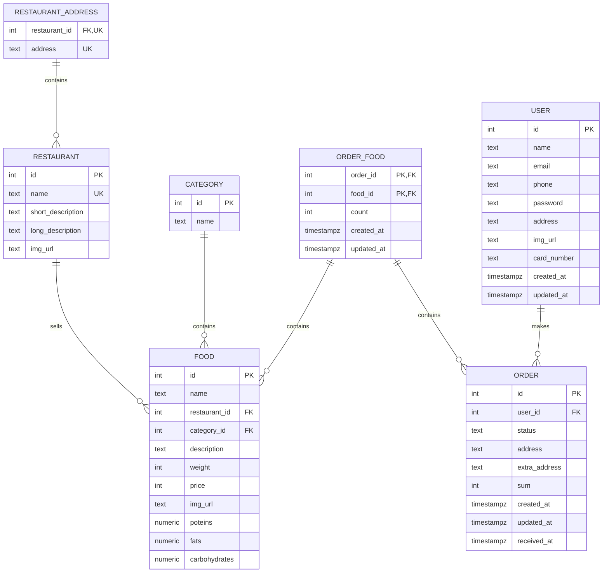

# База данных сервиса "Resto" (Delivery Club) команды Кайрос

## Домашнее задание №1. Проектирование.

## Описание

Сервис включает список ресторанов, страницы ресторанов с блюдами,
создание и оформление заказа.

Были выделены следующие сущности:
1. Ресторан. Включает поля, которые должен видеть пользователь на страницах - название, короткое описание - для страницы с ресторанами, длинное описание - для страницы ресторана, ссылку на картинку
2. Адреса ресторанов. Ресторан может иметь несколько локаций в городе, таблица хранит id ресторана и адрес
3. Еда. Каждый ресторан содержит блюда, которые обладают названием, пищевыми характеристиками, ценой, весом, категорией и ссылкой на картинку
4. Категория. Каждое блюдо относится к категории, например, завтраки, закуски, паста и др. Так что таблица включает название категории
5. Пользователь. Включает имя, почту, телефон, пароль, ссылку на картинку, адрес последнего заказа, номер карты
6. Заказ. Есть пользователь, который его создал, дата и время создание и получения, статус (Корзина, Оформлен, Готов и др), адрес доставки и сумма заказа

Так же есть промежуточная таблица для связи заказов и блюд, включает id блюда и заказа, количество этого блюда в заказе.
Таблицы "Заказ", "Пользователь", связи заказов и блюд обладают служебными полями - дата и время создания и изменения,
так как они подвержены частым изменениям.

## Нормализация

Для удобства укажем основные правила приведения схемы БД к нормальной форме.  

#### 1-ая нормальная форма

    Переменная отношения находится в первой нормальной форме тогда и только тогда, 
    когда в любом допустимом значении отношения каждый его кортеж содержит только одно значение для каждого из атрибутов.

#### 2-ая нормальная форма

    Переменная отношения находится во второй нормальной форме тогда и только тогда, когда она находится в первой 
    нормальной форме, и каждый неключевой атрибут неприводимо (функционально полно) зависит от ее потенциального ключа.

#### 3-я нормальная форма

    Переменная отношения находится в третьей нормальной форме, когда она находится во второй нормальной форме, 
    и отсутствуют транзитивные функциональные зависимости неключевых атрибутов от ключевых.

#### Нормальная форма Бойса-Кодда (НФБК)

    Переменная отношения находится в Нормальная форме Бойса-Кодда тогда и только тогда, когда детерминанты всех её 
    функциональных зависимостей являются потенциальными ключами.

### Функциональные зависимости отношений базы данных

#### Relation "user"

+ {id} -> {name, email, phone, password, address, img_url, card_number, created_at, updated_at}  
    1. Значения атрибутов атомарны (адреса в нашей системе мы считаем атомарными).
    2. Атрибуты функционально полно определяют первичный ключ + Отношение не имеет составного первичного ключа, поэтому проблемы, связанной с зависимостью только от части первичного ключа быть не может.
    3. Нет функциональных зависимостей среди неключевых атрибутов (под неключевыми имеем в виду все, кроме первичного). 
    4. Отношение не имеет составного первичного ключа (НФБК -> 3НФ).

#### Relation category

+ {id} -> {name}  
    1. Значения атрибутов атомарны.
    2. Атрибуты функционально полно определяют первичный ключ + Отношение не имеет составного первичного ключа + Всего один неключевой атрибут.
    3. Нет функциональных зависимостей среди неключевых атрибутов. Он у нас вообще один.
    4. Отношение не имеет составного первичного ключа (НФБК -> 3НФ).

#### Relation restaurant

+ {id} -> {name, short_description, long_description, img_url}  
    1. Значения атрибутов атомарны.
    2. Атрибуты функционально полно определяют первичный ключ. Рестораны 
    3. Нет функциональных зависимостей среди неключевых атрибутов.
    4. Отношение не имеет составного первичного ключа (НФБК -> 3НФ).

#### Relation restaurant_address

+ {restaurant_id} -> {address}  
    1. Значения атрибутов атомарны.
    2. Атрибуты функционально полно определяют первичный ключ --> Отношение не имеет составного первичного ключа + Всего один неключевой атрибут.
    3. Нет функциональных зависимостей среди неключевых атрибутов. Он у нас вообще один.
    4. Отношение не имеет составного первичного ключа (НФБК -> 3НФ).

#### Relation "order"

+ {id} -> {user_id, sum, status, address, extra_address, created_at, updated_at, received_at}  
    1. Значения атрибутов атомарны.
    2. Атрибуты функционально полно определяют первичный ключ. Отношение не имеет составного первичного ключа. 
    3. Нет функциональных зависимостей среди неключевых атрибутов. Все поля являются характеристикой только заказа.
    4. Отношение не имеет составного первичного ключа (НФБК -> 3НФ).

#### Relation food

+ {id} -> {restaurant_id, category_id, name, weight, price, proteins, fats, carbohydrates, img_url}  
    1. Значения атрибутов атомарны.
    2. Атрибуты функционально полно определяют первичный ключ. Отношение не имеет составного первичного ключа.
    3. Нет функциональных зависимостей среди неключевых атрибутов. Все поля являются характеристикой только блюда. 
    4. Отношение не имеет составного первичного ключа.

#### Relation food_order
+ {food_id, order_id} -> {count, created_at, updated_at}
    1. Значения атрибутов атомарны.
    2. Атрибуты функционально полно определяют составной первичный ключ. Кол-во определенного блюда в заказе зависит от самого блюда и номера заказа. В разных заказах это же блюдо может быть в другом количестве.
    3. Нет функциональных зависимостей среди неключевых атрибутов. Все поля являются характеристикой блюда в заказе. `count` характеризует кол-во еды в заказе, другие поля являются суррогатными данными, необходимыми для дебага.
    4. Блюдо не зависит от его кол-ва в заказе. У нас нет такого ограничения, что какое-то блюдо должно быть в определенном кол-ве в заказе и это кол-ве уникальное для каждого блюда (соответствует НФБК). 

### ER-диаграмма
